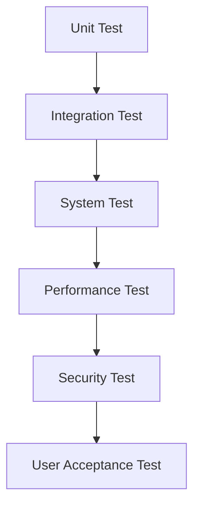

# Financial Data Analysis System Test Plan

## 🎯 Test Strategy Overview

### 1. Test Scope



### 2. Test Environment

```yaml
environments:
  development:
    type: local
    database: h2
    cache: local-redis

  testing:
    type: kubernetes
    namespace: test
    database: test-timescaledb
    cache: test-redis

  staging:
    type: kubernetes
    namespace: staging
    database: staging-timescaledb
    cache: staging-redis

  production:
    type: kubernetes
    namespace: production
    database: prod-timescaledb
    cache: prod-redis
```

## 🧪 Unit Test

### 1. Backend Test

```java
@Test
public void testMarketDataProcessing() {
    // Given
    MarketData data = new MarketData(
        "BTC-USDT",
        new BigDecimal("50000.00"),
        new BigDecimal("100.0"),
        LocalDateTime.now()
    );

    // When
    ProcessedData result = marketDataService.process(data);

    // Then
    assertNotNull(result);
    assertEquals(data.getSymbol(), result.getSymbol());
    assertTrue(result.isValid());
}
```

### 2. AI Model Test

```python
def test_price_prediction():
    # Given
    model = PricePredictionModel()
    test_data = load_test_data()

    # When
    predictions = model.predict(test_data)

    # Then
    assert predictions.shape == (len(test_data), 1)
    assert np.all(predictions > 0)  # Price is always positive
    assert calculate_mape(test_data.y, predictions) < 0.1  # MAPE < 10%
```

## 🔄 Integration Test

### 1. API Test

```typescript
describe("Trading API Integration Tests", () => {
  it("should place market order successfully", async () => {
    // Given
    const order = {
      symbol: "BTC-USDT",
      type: "MARKET",
      side: "BUY",
      quantity: "0.1",
    };

    // When
    const response = await api.post("/v1/orders", order);

    // Then
    expect(response.status).toBe(201);
    expect(response.data.orderId).toBeDefined();
    expect(response.data.status).toBe("FILLED");
  });
});
```

### 2. Data Pipeline Test

```python
def test_data_pipeline_integration():
    # Given
    test_data = generate_test_market_data()

    # When
    pipeline.process(test_data)

    # Then
    processed_data = db.query_latest_data()
    assert_data_integrity(test_data, processed_data)
    assert_processing_latency() < timedelta(milliseconds=100)
```

## 📊 Performance Test

### 1. Load Test

```javascript
import { check } from "k6";
import http from "k6/http";

export const options = {
  scenarios: {
    market_data: {
      executor: "ramping-vus",
      startVUs: 0,
      stages: [
        { duration: "2m", target: 100 },
        { duration: "5m", target: 100 },
        { duration: "2m", target: 0 },
      ],
      gracefulRampDown: "30s",
    },
  },
  thresholds: {
    http_req_duration: ["p(95)<500"],
  },
};

export default function () {
  const response = http.get("http://api.example.com/v1/market/price/BTC-USDT");
  check(response, {
    "is status 200": (r) => r.status === 200,
    "response time < 500ms": (r) => r.timings.duration < 500,
  });
}
```

### 2. Stress Test

```yaml
stress_test_scenarios:
  - name: "급격한 시장 변동 시뮬레이션"
    duration: "30m"
    data_rate: "10000 events/second"
    expectations:
      - max_latency: 100ms
      - error_rate: < 0.1%
      - cpu_usage: < 80%
      - memory_usage: < 85%
```

## 🔒 Security Test

### 1. Vulnerability Scan

```yaml
security_scan:
  tools:
    - name: "OWASP ZAP"
      target: "https://api.example.com"
      rules:
        - sql-injection
        - xss
        - csrf

    - name: "SonarQube"
      target: "source-code"
      quality_gates:
        security_rating: A
        security_review_rating: A
```

### 2. Penetration Test

```yaml
penetration_test:
  scenarios:
    - name: "인증 우회 시도"
      steps:
        - jwt_token_manipulation
        - session_hijacking
        - brute_force_attack

    - name: "권한 상승 시도"
      steps:
        - role_manipulation
        - horizontal_privilege_escalation
```

## 📱 User Acceptance Test

### 1. Scenario Test

```typescript
describe("Trading Workflow", () => {
  it("should complete basic trading cycle", async () => {
    // 1. Login
    await user.login();

    // 2. Check market data
    const marketData = await dashboard.getMarketData();
    expect(marketData).toBeValid();

    // 3. Check trading signal
    const signal = await analysis.getTradingSignal();
    expect(signal.confidence).toBeGreaterThan(0.7);

    // 4. Execute order
    const order = await trading.placeOrder(signal);
    expect(order.status).toBe("SUCCESS");
  });
});
```

### 2. Usability Test

```yaml
usability_test_cases:
  - scenario: "First trading execution"
    user_group: "Beginner trader"
    success_criteria:
      - max_time: 5 minutes
      - max_clicks: 7
      - error_rate: 0%

  - scenario: "Portfolio analysis"
    user_group: "Expert trader"
    success_criteria:
      - data_accuracy: 100%
      - refresh_rate: < 1 second
      - analysis_depth: All indicators included
```

## 📈 Quality Metrics

### 1. Code Quality

```yaml
quality_metrics:
  code_coverage:
    unit_tests: > 80%
    integration_tests: > 70%

  complexity:
    cyclomatic: < 15
    cognitive: < 10

  duplication:
    threshold: < 5%
```

### 2. Performance Metrics

```yaml
performance_metrics:
  api_response_time:
    p95: < 500ms
    p99: < 1000ms

  data_processing:
    latency: < 100ms
    throughput: > 5000 events/second

  model_inference:
    latency: < 200ms
    accuracy: > 85%
```

This document provides the test strategy and quality assurance plan for the financial data analysis system. It will be updated continuously to ensure the stability and reliability of the system. 🚀
