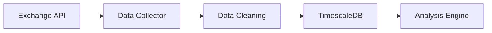

# Financial Data Analysis System Database Design

##  Database Architecture

### 1. Database Selection Rationale

- **PostgreSQL**: RDBMS proven for stability and scalability
- **TimescaleDB**: Extension optimized for time-series data processing
- **Partitioning**: Efficient management of large-scale data

### 2. Core Table Structures

#### 2.1 Market Data Tables

```sql
--   
CREATE TABLE market_data (
    id BIGSERIAL PRIMARY KEY,
    symbol VARCHAR(20) NOT NULL,
    exchange VARCHAR(20) NOT NULL,
    timestamp TIMESTAMPTZ NOT NULL,
    price DECIMAL(20,8) NOT NULL,
    volume DECIMAL(20,8) NOT NULL,
    created_at TIMESTAMPTZ DEFAULT CURRENT_TIMESTAMP
) PARTITION BY RANGE (timestamp);

--  
CREATE TABLE option_data (
    id BIGSERIAL PRIMARY KEY,
    underlying VARCHAR(20) NOT NULL,
    strike_price DECIMAL(20,8) NOT NULL,
    expiry_date TIMESTAMPTZ NOT NULL,
    option_type VARCHAR(4) NOT NULL,
    iv DECIMAL(10,4),
    delta DECIMAL(10,4),
    gamma DECIMAL(10,4),
    theta DECIMAL(10,4),
    vega DECIMAL(10,4),
    timestamp TIMESTAMPTZ NOT NULL
) PARTITION BY RANGE (timestamp);
```

#### 2.2   

```sql
-- AI Model Prediction Results
CREATE TABLE predictions (
    id BIGSERIAL PRIMARY KEY,
    model_id VARCHAR(50) NOT NULL,
    symbol VARCHAR(20) NOT NULL,
    prediction_type VARCHAR(20) NOT NULL,
    predicted_value DECIMAL(20,8) NOT NULL,
    confidence DECIMAL(5,4) NOT NULL,
    timestamp TIMESTAMPTZ NOT NULL
);

-- Portfolio Status
CREATE TABLE portfolio_status (
    id BIGSERIAL PRIMARY KEY,
    user_id UUID NOT NULL,
    asset_type VARCHAR(20) NOT NULL,
    position_size DECIMAL(20,8) NOT NULL,
    entry_price DECIMAL(20,8) NOT NULL,
    current_price DECIMAL(20,8) NOT NULL,
    pnl DECIMAL(20,8) NOT NULL,
    timestamp TIMESTAMPTZ NOT NULL
);
```

### 3. Indexing Strategy

#### 3.1 Market Data Indexing

```sql
-- Optimize market data query
CREATE INDEX idx_market_data_symbol_timestamp ON market_data (symbol, timestamp DESC);
CREATE INDEX idx_market_data_exchange_timestamp ON market_data (exchange, timestamp DESC);

-- Optimize option data query
CREATE INDEX idx_option_data_underlying_expiry ON option_data (underlying, expiry_date);
CREATE INDEX idx_option_data_strike_type ON option_data (strike_price, option_type);
```

#### 3.2 Analysis Data Indexing

```sql
-- Optimize prediction data query
CREATE INDEX idx_predictions_model_symbol ON predictions (model_id, symbol);
CREATE INDEX idx_predictions_timestamp ON predictions (timestamp DESC);

-- Optimize portfolio query
CREATE INDEX idx_portfolio_user_timestamp ON portfolio_status (user_id, timestamp DESC);
```

### 4. Partitioning Strategy

#### 4.1 Time-series Data Partitioning

```sql
-- Create monthly partitions
CREATE TABLE market_data_y2024m01 PARTITION OF market_data
    FOR VALUES FROM ('2024-01-01') TO ('2024-02-01');
CREATE TABLE market_data_y2024m02 PARTITION OF market_data
    FOR VALUES FROM ('2024-02-01') TO ('2024-03-01');
```

#### 4.2 Retention Policy

- Real-time data: Latest 3 months
- Aggregated data: Latest 1 year
- Historical data: S3 archive

##  Performance Optimization

### 1. Query Optimization

#### 1.1 Frequent Queries

```sql
-- Query specific period OHLCV data
CREATE MATERIALIZED VIEW mv_ohlcv_1h AS
SELECT
    symbol,
    date_trunc('hour', timestamp) as timeframe,
    first(price) as open,
    max(price) as high,
    min(price) as low,
    last(price) as close,
    sum(volume) as volume
FROM market_data
GROUP BY symbol, timeframe;
```

#### 1.2 Caching Strategy

- Implement Redis caching layer
- Real-time data memory caching
- Configure aggregated data cache refresh interval

### 2. Backup Strategy

#### 2.1 Regular Backups

- Daily incremental backups
- Weekly full backups
- Monthly archive

#### 2.2 Recovery Plan

- Point-in-Time Recovery setup
- Documented disaster recovery scenarios
- Planned recovery tests

##  Data Flow

### 1. Data Collection



### 2. Data Processing

- Real-time stream processing
- Batch processing
- Anomaly detection and handling

##  Considerations for Scalability

### 1. Horizontal Scaling

- Configure read-only replicas
- Establish sharding strategy
- Set up load balancing

### 2. Vertical Scaling

- Monitor resource usage
- Set performance metrics
- Define scaling thresholds

This document provides the database design standards for the financial data analysis system. It will be updated continuously considering the system requirements and performance. 
