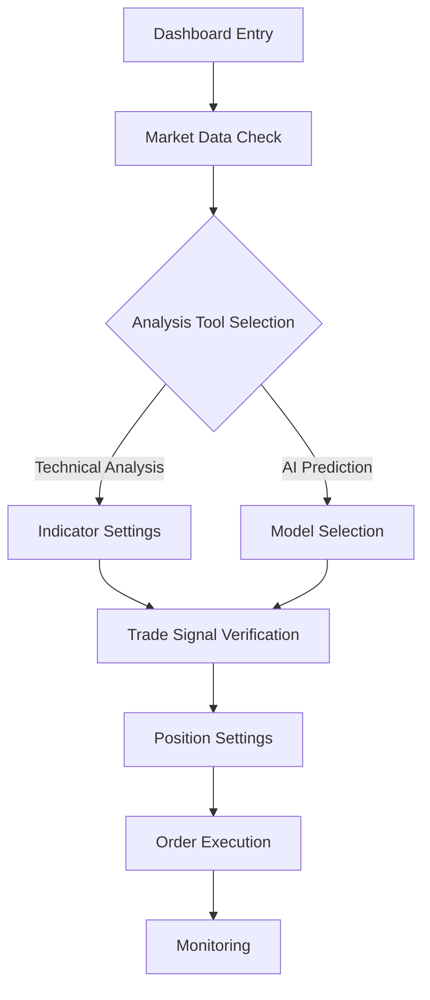
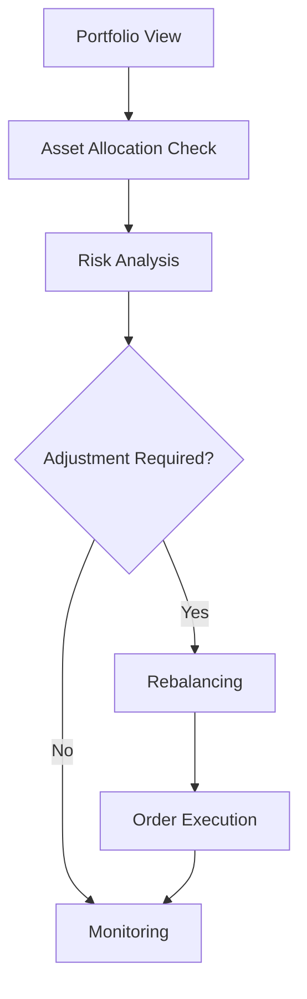

# Financial Data Analysis System UI/UX Design Guide

##  Design System

### 1. Color Palette

```css
:root {
  /* Main colors */
  --primary-100: #e3f2fd;
  --primary-500: #2196f3;
  --primary-900: #0d47a1;

  /* Secondary colors */
  --secondary-100: #f3e5f5;
  --secondary-500: #9c27b0;
  --secondary-900: #4a148c;

  /* Status colors */
  --success: #4caf50;
  --warning: #ffc107;
  --error: #f44336;
  --info: #2196f3;

  /* Neutral colors */
  --neutral-100: #f5f5f5;
  --neutral-300: #e0e0e0;
  --neutral-500: #9e9e9e;
  --neutral-700: #616161;
  --neutral-900: #212121;
}
```

### 2. Typography

```css
:root {
  /* Font families */
  --font-primary: "Inter", sans-serif;
  --font-secondary: "Roboto Mono", monospace;

  /* Font sizes */
  --text-xs: 0.75rem; /* 12px */
  --text-sm: 0.875rem; /* 14px */
  --text-base: 1rem; /* 16px */
  --text-lg: 1.125rem; /* 18px */
  --text-xl: 1.25rem; /* 20px */
  --text-2xl: 1.5rem; /* 24px */

  /* Font weights */
  --font-light: 300;
  --font-regular: 400;
  --font-medium: 500;
  --font-bold: 700;
}
```

### 3. Grid System

```css
.container {
  display: grid;
  grid-template-columns: repeat(12, 1fr);
  gap: var(--spacing-4);

  @media (max-width: 768px) {
    grid-template-columns: repeat(4, 1fr);
  }
}
```

##  Component Library

### 1. Chart Component

#### 1.1 Candlestick Chart

```typescript
interface CandlestickProps {
  data: {
    timestamp: string;
    open: number;
    high: number;
    low: number;
    close: number;
  }[];
  width?: number;
  height?: number;
  theme?: "light" | "dark";
}

const Candlestick: React.FC<CandlestickProps> = ({
  data,
  width = 800,
  height = 400,
  theme = "light",
}) => {
  // Chart implementation
};
```

#### 1.2 Technical Indicators

```typescript
interface TechnicalIndicatorProps {
  type: "MA" | "RSI" | "MACD";
  data: number[];
  parameters: {
    period?: number;
    signal?: number;
  };
}
```

### 2. Dashboard Layout

```typescript
interface DashboardLayoutProps {
  sidebar?: React.ReactNode;
  header?: React.ReactNode;
  main: React.ReactNode;
  footer?: React.ReactNode;
}

const DashboardLayout: React.FC<DashboardLayoutProps> = ({
  sidebar,
  header,
  main,
  footer,
}) => (
  <div className="dashboard-layout">
    {sidebar && <aside className="sidebar">{sidebar}</aside>}
    <div className="main-content">
      {header && <header className="header">{header}</header>}
      <main className="main">{main}</main>
      {footer && <footer className="footer">{footer}</footer>}
    </div>
  </div>
);
```

##  User Flow

### 1. Trading Flow



### 2. Portfolio Management



##  Responsive Design

### 1. Breakpoints

```scss
$breakpoints: (
  "mobile": 320px,
  "tablet": 768px,
  "desktop": 1024px,
  "wide": 1440px,
);

@mixin respond-to($breakpoint) {
  @if map-has-key($breakpoints, $breakpoint) {
    @media (min-width: map-get($breakpoints, $breakpoint)) {
      @content;
    }
  }
}
```

### 2. Layout Adjustment

```scss
.trading-view {
  display: grid;
  gap: 1rem;

  @include respond-to("mobile") {
    grid-template-columns: 1fr;
  }

  @include respond-to("tablet") {
    grid-template-columns: repeat(2, 1fr);
  }

  @include respond-to("desktop") {
    grid-template-columns: repeat(3, 1fr);
  }
}
```

##  Accessibility

### 1. ARIA Labels

```typescript
const PriceAlert: React.FC = () => (
  <div role="alert" aria-live="polite" aria-atomic="true">
    <span className="price-change">+5.23%</span>
  </div>
);
```

### 2. Keyboard Navigation

```typescript
const TradingPanel: React.FC = () => {
  const handleKeyPress = (e: KeyboardEvent) => {
    switch (e.key) {
      case "ArrowUp":
        incrementPrice();
        break;
      case "ArrowDown":
        decrementPrice();
        break;
      case "Enter":
        submitOrder();
        break;
    }
  };

  return (
    <div
      tabIndex={0}
      onKeyDown={handleKeyPress}
      role="region"
      aria-label=" "
    >
      {/* Trading panel content */}
    </div>
  );
};
```

##  Usability Testing

### 1. Test Scenarios

```typescript
const usabilityTests = [
  {
    name: "Basic Trading Flow",
    steps: [
      "Dashboard Access",
      "Chart Analysis",
      "Order Settings",
      "Order Execution",
      "Result Verification",
    ],
    success_criteria: [
      "3 minutes completion",
      "Error-free execution",
      "User satisfaction 4/5 or higher",
    ],
  },
];
```

### 2. Feedback Collection

```typescript
interface UserFeedback {
  task: string;
  completion_time: number;
  error_count: number;
  satisfaction: number;
  comments: string;
}
```

This document provides the UI/UX design guide for the financial data analysis system. It will be updated continuously to optimize user experience, reflecting feedback and improvements. 
