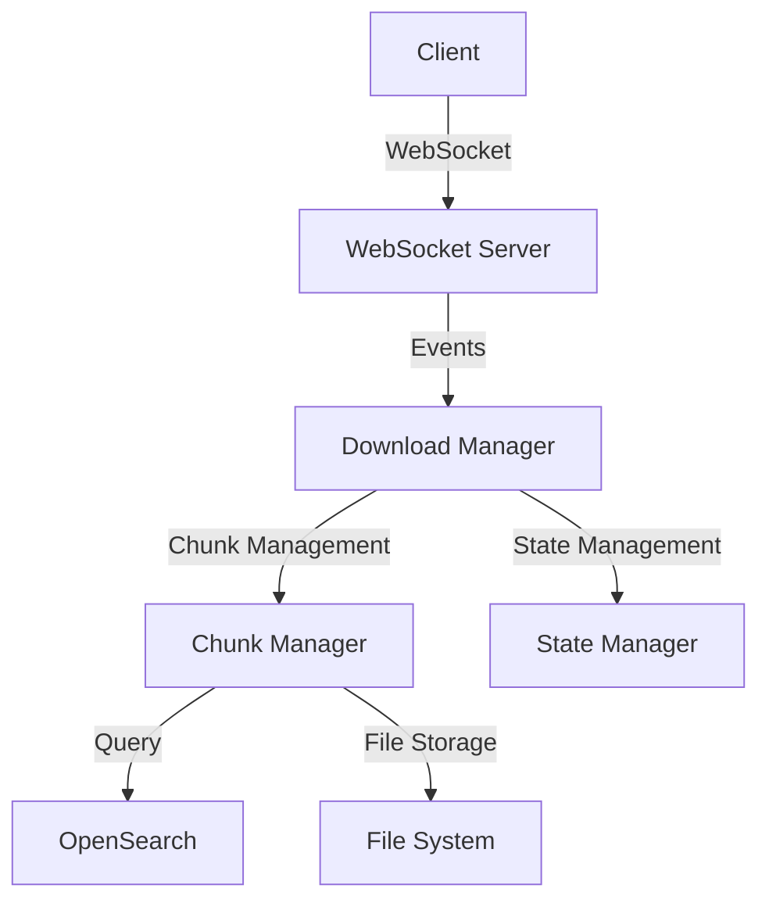

# Project Overview

## 1. System Architecture

### 1.1 Overall Structure



### 1.2 Key Components

- **WebSocket Server**: Real-time communication processing
- **Download Manager**: Download process coordination
- **Chunk Manager**: Data chunk processing
- **State Manager**: Status and progress management

## 2. Technology Stack

### 2.1 Frontend

- **Framework**: Next.js 13+
- **State Management**: React Query
- **WebSocket**: Socket.IO-client
- **UI Library**: MUI/Tailwind

### 2.2 Backend

- **Runtime**: Node.js 18+
- **WebSocket**: Socket.IO
- **Database**: OpenSearch
- **File Processing**: Node.js Streams

### 2.3 Development Tools

- **Language**: TypeScript 4.9+
- **Build**: Webpack/Babel
- **Testing**: Jest
- **Linting**: ESLint/Prettier

## 3. Core Features

### 3.1 Login Feature


### 3.2 Search Feature

#### Search Term Input and Results Display


#### Search Results Filtering


### 3.3 Download Feature

#### Download Initiation


#### Download Progress Status


### 3.4 Download Management

- Large file chunk processing
- Real-time progress updates
- Automatic retry mechanism
- Memory usage optimization

### 3.5 Error Handling

- Network error recovery
- Memory shortage handling
- Timeout management
- Incomplete file cleanup

### 3.6 Monitoring

- Real-time progress tracking
- Resource usage monitoring
- Error logging
- Performance metrics collection

## 4. Project Structure

```bash
src/
 server/
    lib/
       downloadManager.ts      # Download management
       downloadChunkManager.ts # Chunk processing
       stateManager.ts        # State management
       opensearch.ts          # DB connection
       utils/
           logger.ts          # Logging
           errors.ts          # Error handling
    index.ts                   # Server entry point
 client/
    components/
       DownloadButton.tsx     # Download button
       ProgressBar.tsx        # Progress display
       ErrorDisplay.tsx       # Error display
    hooks/
       useDownload.ts         # Download hook
       useWebSocket.ts        # WebSocket hook
    utils/
        api.ts                 # API utilities
        format.ts              # Format utilities
 shared/
     types/                     # Type definitions
     constants/                 # Constant definitions
```

## 5. Configuration Management

### 5.1 Environment Variables

```env
# Server
PORT=8001
WS_PORT=8001
NODE_ENV=development

# OpenSearch
OPENSEARCH_HOST=localhost
OPENSEARCH_PORT=9200
OPENSEARCH_USERNAME=dev
OPENSEARCH_PASSWORD=dev

# Download
MAX_CHUNK_SIZE=500000
MAX_MEMORY_USAGE=1024
DOWNLOAD_TIMEOUT=300000
```

### 5.2 Configuration File

```typescript
// config.ts
export const CONFIG = {
  download: {
    chunkSize: 500000,
    maxRetries: 3,
    timeout: 300000,
    tempDir: "./temp",
  },
  websocket: {
    pingInterval: 10000,
    pingTimeout: 5000,
  },
  opensearch: {
    scrollTimeout: "2m",
    batchSize: 1000,
  },
};
```
