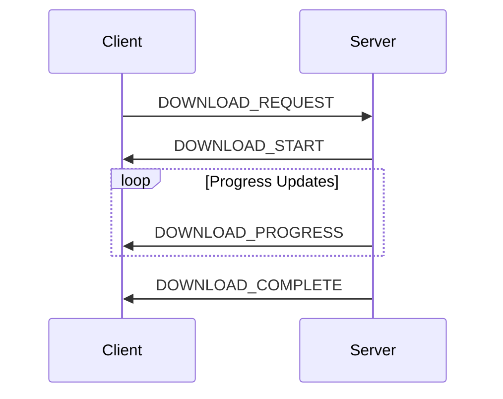

# Communication Protocol

## 1. WebSocket Event Definition

### 1.1 Event Type

```typescript
enum WebSocketEvent {
  // Download related
  DOWNLOAD_REQUEST = "download:request",
  DOWNLOAD_START = "download:start",
  DOWNLOAD_PROGRESS = "download:progress",
  DOWNLOAD_COMPLETE = "download:complete",
  DOWNLOAD_ERROR = "download:error",

  // Status related
  STATUS_UPDATE = "status:update",
  STATUS_CHECK = "status:check",

  // System related
  SYSTEM_ERROR = "system:error",
  CONNECTION_HEALTH = "connection:health",
}
```

### 1.2 Message Format

```typescript
interface WebSocketMessage<T = any> {
  event: WebSocketEvent;
  data: T;
  timestamp: number;
  requestId: string;
}

interface DownloadRequest {
  searchParams: {
    timeFrom: string;
    timeTo: string;
    filters: Filter[];
  };
  outputFormat: "csv" | "json";
  compression: boolean;
}

interface ProgressUpdate {
  requestId: string;
  progress: number;
  processedRows: number;
  totalRows: number;
  speed: number;
  estimatedTimeRemaining: number;
}
```

## 2. Message Flow

### 2.1 Download Start



### 2.2 Error Handling Flow

```typescript
interface ErrorResponse {
  code: string;
  message: string;
  details?: any;
  recoverable: boolean;
  retryAfter?: number;
}

const errorHandler = {
  handleError(error: Error): ErrorResponse {
    return {
      code: determineErrorCode(error),
      message: error.message,
      recoverable: isRecoverable(error),
      retryAfter: calculateRetryDelay(error),
    };
  },
};
```

## 3. Status Management

### 3.1 Connection State Management

```typescript
class ConnectionManager {
  private reconnectAttempts: number = 0;
  private maxReconnectAttempts: number = 5;
  private reconnectDelay: number = 1000;

  async handleDisconnect() {
    if (this.reconnectAttempts < this.maxReconnectAttempts) {
      await this.reconnect();
    } else {
      this.emit("connection:failed");
    }
  }
}
```

### 3.2 Session State

```typescript
interface SessionState {
  connected: boolean;
  lastHeartbeat: number;
  activeDownloads: Map<string, DownloadStatus>;
  systemHealth: SystemHealth;
}
```

## 4. Security

### 4.1 Authentication

```typescript
interface AuthenticatedMessage extends WebSocketMessage {
  auth: {
    token: string;
    timestamp: number;
    signature: string;
  };
}

const authenticator = {
  validateMessage(message: AuthenticatedMessage): boolean {
    return (
      this.verifySignature(message) &&
      this.checkTimestamp(message.auth.timestamp)
    );
  },
};
```

### 4.2 Message Encryption

```typescript
class MessageEncryption {
  private readonly algorithm = "aes-256-gcm";

  encrypt(message: WebSocketMessage): EncryptedMessage {
    const iv = crypto.randomBytes(12);
    const cipher = crypto.createCipheriv(this.algorithm, this.key, iv);

    return {
      encrypted: Buffer.concat([
        cipher.update(JSON.stringify(message)),
        cipher.final(),
      ]),
      iv: iv,
      tag: cipher.getAuthTag(),
    };
  }
}
```

## 5. Performance Optimization

### 5.1 Message Compression

```typescript
class MessageCompression {
  compress(message: WebSocketMessage): Buffer {
    return zlib.deflateSync(JSON.stringify(message));
  }

  decompress(compressed: Buffer): WebSocketMessage {
    return JSON.parse(zlib.inflateSync(compressed).toString());
  }
}
```

### 5.2 Batch Processing

```typescript
class MessageBatcher {
  private batchSize: number = 100;
  private batchTimeout: number = 1000;
  private batch: ProgressUpdate[] = [];

  addToBatch(update: ProgressUpdate) {
    this.batch.push(update);

    if (this.shouldFlush()) {
      this.flushBatch();
    }
  }
}
```
