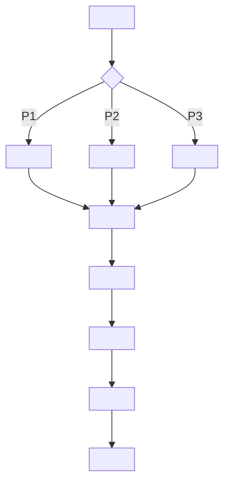

#      

##   

### 1.   

```yaml
monitoring_metrics:
  system_health:
    - cpu_usage:
        warning: 70%
        critical: 85%
    - memory_usage:
        warning: 75%
        critical: 90%
    - disk_usage:
        warning: 80%
        critical: 90%

  application_metrics:
    - api_latency:
        p95_threshold: 500ms
        p99_threshold: 1000ms
    - error_rate:
        threshold: 0.1%
    - request_rate:
        min: 100/s
        max: 10000/s
```

### 2.  

```yaml
alert_rules:
  high_priority:
    - condition: "error_rate > 1%"
      duration: "5m"
      channels:
        - slack: "#alerts-critical"
        - pagerduty: "trading-team"

  medium_priority:
    - condition: "api_latency_p95 > 500ms"
      duration: "10m"
      channels:
        - slack: "#alerts-warning"

  low_priority:
    - condition: "cpu_usage > 70%"
      duration: "15m"
      channels:
        - slack: "#alerts-info"
```

##    

### 1.  

```sql
--   
-- 1.  
REINDEX DATABASE trading_db;

-- 2.  
ANALYZE VERBOSE;

-- 3.   
INSERT INTO market_data_archive
SELECT * FROM market_data
WHERE timestamp < NOW() - INTERVAL '3 months';

DELETE FROM market_data
WHERE timestamp < NOW() - INTERVAL '3 months';
```

### 2.  

```yaml
log_rotation:
  application_logs:
    retention: 30d
    max_size: 10GB
    compression: true

  system_logs:
    retention: 90d
    max_size: 50GB
    compression: true

  audit_logs:
    retention: 365d
    max_size: 100GB
    compression: true
    encryption: true
```

##   

### 1.   

```yaml
incident_levels:
  p1_critical:
    description: "  "
    response_time: "15 "
    resolution_time: "2 "
    escalation:
      - devops_lead
      - system_architect
      - cto

  p2_major:
    description: "  "
    response_time: "30 "
    resolution_time: "4 "
    escalation:
      - devops_engineer
      - team_lead

  p3_minor:
    description: "  "
    response_time: "2 "
    resolution_time: "8 "
    escalation:
      - on_call_engineer
```

### 2.   



##    

### 1.  

```yaml
backup_policy:
  full_backup:
    schedule: "  01:00"
    retention: "4"
    type: ""

  incremental_backup:
    schedule: " 01:00"
    retention: "7"
    type: "WAL"

  transaction_logs:
    archive: true
    retention: "30"
```

### 2.  

```bash
#!/bin/bash

# 1.  
kubectl scale deployment trading-api --replicas=0

# 2.  
pg_restore -h $DB_HOST -U $DB_USER -d trading_db backup.dump

# 3.   
python verify_data_integrity.py

# 4.  
kubectl scale deployment trading-api --replicas=3

# 5.  
kubectl get pods -l app=trading-api
```

##   

### 1.  

```yaml
access_control:
  production:
    ssh_access:
      - role: admin
        auth: public_key + 2FA
      - role: developer
        auth: public_key + 2FA
        restrictions:
          - read_only
          - audit_logging

    kubernetes:
      - role: cluster-admin
        users: ["devops-lead"]
      - role: developer
        users: ["dev-team"]
        namespace: ["dev", "staging"]
```

### 2.  

```yaml
security_checks:
  daily:
    - vulnerability_scan
    - auth_log_review
    - failed_login_attempts

  weekly:
    - dependency_updates
    - ssl_cert_check
    - firewall_rule_review

  monthly:
    - penetration_test
    - security_policy_review
    - access_right_audit
```

##   

### 1.  

```yaml
cache_strategy:
  market_data:
    ttl: 60s
    max_size: 1GB
    eviction: LRU

  user_portfolio:
    ttl: 300s
    max_size: 500MB
    eviction: LFU

  trading_signals:
    ttl: 30s
    max_size: 200MB
    eviction: FIFO
```

### 2.  

```yaml
resource_optimization:
  autoscaling:
    cpu_target: 70%
    memory_target: 75%
    min_replicas: 3
    max_replicas: 10

  pod_resources:
    requests:
      cpu: 1
      memory: 2Gi
    limits:
      cpu: 2
      memory: 4Gi
```

          .      . 
