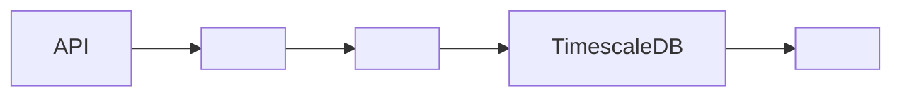

#      

##   

### 1.   

- **PostgreSQL**:    RDBMS
- **TimescaleDB**:     
- ****:    

### 2.   

#### 2.1 Market Data Tables

```sql
--   
CREATE TABLE market_data (
    id BIGSERIAL PRIMARY KEY,
    symbol VARCHAR(20) NOT NULL,
    exchange VARCHAR(20) NOT NULL,
    timestamp TIMESTAMPTZ NOT NULL,
    price DECIMAL(20,8) NOT NULL,
    volume DECIMAL(20,8) NOT NULL,
    created_at TIMESTAMPTZ DEFAULT CURRENT_TIMESTAMP
) PARTITION BY RANGE (timestamp);

--  
CREATE TABLE option_data (
    id BIGSERIAL PRIMARY KEY,
    underlying VARCHAR(20) NOT NULL,
    strike_price DECIMAL(20,8) NOT NULL,
    expiry_date TIMESTAMPTZ NOT NULL,
    option_type VARCHAR(4) NOT NULL,
    iv DECIMAL(10,4),
    delta DECIMAL(10,4),
    gamma DECIMAL(10,4),
    theta DECIMAL(10,4),
    vega DECIMAL(10,4),
    timestamp TIMESTAMPTZ NOT NULL
) PARTITION BY RANGE (timestamp);
```

#### 2.2   

```sql
-- AI   
CREATE TABLE predictions (
    id BIGSERIAL PRIMARY KEY,
    model_id VARCHAR(50) NOT NULL,
    symbol VARCHAR(20) NOT NULL,
    prediction_type VARCHAR(20) NOT NULL,
    predicted_value DECIMAL(20,8) NOT NULL,
    confidence DECIMAL(5,4) NOT NULL,
    timestamp TIMESTAMPTZ NOT NULL
);

--  
CREATE TABLE portfolio_status (
    id BIGSERIAL PRIMARY KEY,
    user_id UUID NOT NULL,
    asset_type VARCHAR(20) NOT NULL,
    position_size DECIMAL(20,8) NOT NULL,
    entry_price DECIMAL(20,8) NOT NULL,
    current_price DECIMAL(20,8) NOT NULL,
    pnl DECIMAL(20,8) NOT NULL,
    timestamp TIMESTAMPTZ NOT NULL
);
```

### 3.  

#### 3.1   

```sql
--    
CREATE INDEX idx_market_data_symbol_timestamp ON market_data (symbol, timestamp DESC);
CREATE INDEX idx_market_data_exchange_timestamp ON market_data (exchange, timestamp DESC);

--    
CREATE INDEX idx_option_data_underlying_expiry ON option_data (underlying, expiry_date);
CREATE INDEX idx_option_data_strike_type ON option_data (strike_price, option_type);
```

#### 3.2   

```sql
--    
CREATE INDEX idx_predictions_model_symbol ON predictions (model_id, symbol);
CREATE INDEX idx_predictions_timestamp ON predictions (timestamp DESC);

--   
CREATE INDEX idx_portfolio_user_timestamp ON portfolio_status (user_id, timestamp DESC);
```

### 4.  

#### 4.1   

```sql
--   
CREATE TABLE market_data_y2024m01 PARTITION OF market_data
    FOR VALUES FROM ('2024-01-01') TO ('2024-02-01');
CREATE TABLE market_data_y2024m02 PARTITION OF market_data
    FOR VALUES FROM ('2024-02-01') TO ('2024-03-01');
```

#### 4.2  

-  :  3
-  :  1
-  : S3 

##   

### 1.  

#### 1.1   

```sql
--   OHLCV  
CREATE MATERIALIZED VIEW mv_ohlcv_1h AS
SELECT
    symbol,
    date_trunc('hour', timestamp) as timeframe,
    first(price) as open,
    max(price) as high,
    min(price) as low,
    last(price) as close,
    sum(volume) as volume
FROM market_data
GROUP BY symbol, timeframe;
```

#### 1.2  

- Redis   
-    
-      

### 2.  

#### 2.1  

-   
-   
-  

#### 2.2  

- Point-in-Time Recovery 
-    
-   

##   

### 1.  



### 2.  

-   
-  
-    

##   

### 1.  

-    
-   
-   

### 2.  

-  
-   
-    

         .       . 
