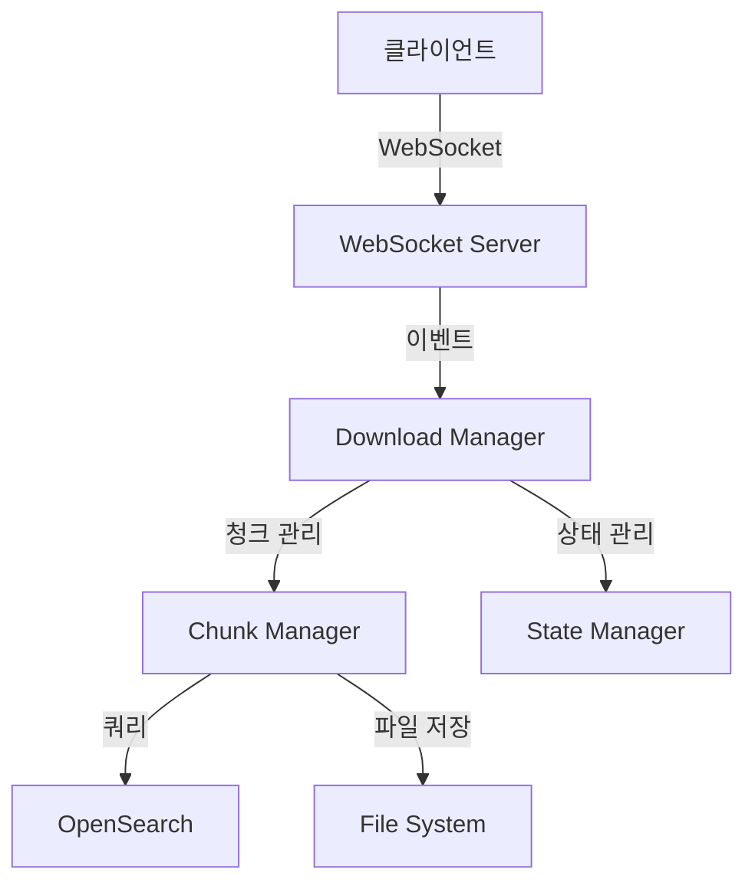

# 프로젝트 개요

## 1. 시스템 아키텍처

### 1.1 전체 구조



### 1.2 주요 컴포넌트

- **WebSocket Server**: 실시간 통신 처리
- **Download Manager**: 다운로드 프로세스 조율
- **Chunk Manager**: 데이터 청크 처리
- **State Manager**: 상태 및 진행률 관리

## 2. 기술 스택

### 2.1 프론트엔드

- **Framework**: Next.js 13+
- **상태 관리**: React Query
- **WebSocket**: Socket.IO-client
- **UI 라이브러리**: MUI/Tailwind

### 2.2 백엔드

- **Runtime**: Node.js 18+
- **WebSocket**: Socket.IO
- **데이터베이스**: OpenSearch
- **파일 처리**: Node.js Streams

### 2.3 개발 도구

- **언어**: TypeScript 4.9+
- **빌드**: Webpack/Babel
- **테스트**: Jest
- **린팅**: ESLint/Prettier

## 3. 핵심 기능

### 3.1 로그인 기능


### 3.2 검색 기능

검색어 입력 및 결과 표시:


검색 결과 필터링:


### 3.3 다운로드 기능

다운로드 시작:


다운로드 진행 상태:


### 3.4 다운로드 관리

- 대용량 파일 청크 처리
- 진행률 실시간 업데이트
- 자동 재시도 메커니즘
- 메모리 사용량 최적화

### 3.5 에러 처리

- 네트워크 오류 복구
- 메모리 부족 대응
- 타임아웃 관리
- 불완전 파일 정리

### 3.6 모니터링

- 실시간 진행률 추적
- 리소스 사용량 모니터링
- 에러 로깅
- 성능 메트릭 수집

## 4. 프로젝트 구조

```bash
src/
├── server/
│   ├── lib/
│   │   ├── downloadManager.ts      # 다운로드 관리
│   │   ├── downloadChunkManager.ts # 청크 처리
│   │   ├── stateManager.ts        # 상태 관리
│   │   ├── opensearch.ts          # DB 연동
│   │   └── utils/
│   │       ├── logger.ts          # 로깅
│   │       └── errors.ts          # 에러 처리
│   └── index.ts                   # 서버 시작점
├── client/
│   ├── components/
│   │   ├── DownloadButton.tsx     # 다운로드 버튼
│   │   ├── ProgressBar.tsx        # 진행률 표시
│   │   └── ErrorDisplay.tsx       # 에러 표시
│   ├── hooks/
│   │   ├── useDownload.ts         # 다운로드 훅
│   │   └── useWebSocket.ts        # 웹소켓 훅
│   └── utils/
│       ├── api.ts                 # API 유틸
│       └── format.ts              # 포맷 유틸
└── shared/
    ├── types/                     # 타입 정의
    └── constants/                 # 상수 정의
```

## 5. 설정 관리

### 5.1 환경 변수

```env
# Server
PORT=8001
WS_PORT=8001
NODE_ENV=development

# OpenSearch
OPENSEARCH_HOST=localhost
OPENSEARCH_PORT=9200
OPENSEARCH_USERNAME=admin
OPENSEARCH_PASSWORD=admin

# Download
MAX_CHUNK_SIZE=500000
MAX_MEMORY_USAGE=1024
DOWNLOAD_TIMEOUT=300000
```

### 5.2 설정 파일

```typescript
// config.ts
export const CONFIG = {
  download: {
    chunkSize: 500000,
    maxRetries: 3,
    timeout: 300000,
    tempDir: "./temp",
  },
  websocket: {
    pingInterval: 10000,
    pingTimeout: 5000,
  },
  opensearch: {
    scrollTimeout: "2m",
    batchSize: 1000,
  },
};
```
